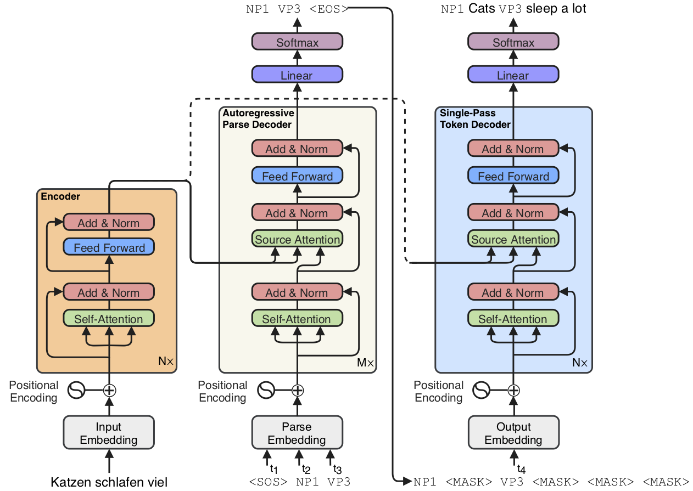

# SynST: Syntactically Supervised Transformers

This is the official repository which contains all the code necessary to
replicate the results from the ACL 2019 long paper *[Syntactically Supervised
Transformers for Faster Neural Machine Translation](https://arxiv.org/abs/1906.02780)*. It can also be used to
train a vanilla Transformer or a [Semi-Autoregressive
Transformer](https://aclweb.org/anthology/D18-1044).

The full model architecture is displayed below:

<p>

</p>

Our approach uses syntactic supervision to speed up
neural machine translation (NMT) for the Transformer architecture. We modify
the Transformer architecture by adding a single layer parse decoder that
autoregressively predicts a shallow chunking of the target parse. Then, conditioned on this
parse, a separate token decoder generates the final target translation in one shot (non-autoregressively). The figure above demonstrates the inputs and outputs for each module
in the architecture.

## Requirements

The code requires Python 3.6+. The python dependencies can be installed with the
command (using a virtual environment is highly recommended):

```sh
pip install -r requirements.txt
```

In order to parse the datasets, the code also depends upon the shift-reduce
parsers from [CoreNLP](https://stanfordnlp.github.io/CoreNLP/). First, make sure
you have an appropriate Java runtime installed.

Then download and unzip the main CoreNLP package to the directory of your
choice:

```sh
curl -O https://nlp.stanford.edu/software/stanford-corenlp-full-2018-10-05.zip
unzip stanford-corenlp-full-2018-10-05.zip
```

You'll also need download the shift reduce parsers for each of the languages:
```sh
cd stanford-corenlp-full-2018-10-05
curl -O https://nlp.stanford.edu/software/stanford-srparser-2014-10-23-models.jar
curl -O https://nlp.stanford.edu/software/stanford-french-corenlp-2018-10-05-models.jar
curl -O https://nlp.stanford.edu/software/stanford-german-corenlp-2018-10-05-models.jar
```

Additionally, if you want to use the scripts that wrap `multi-bleu.perl` and
`sacrebleu`, then you'll need to have
[Moses-SMT](https://github.com/moses-smt/mosesdecoder) available as well.

## Basic Usage

The code has one main entry point `main.py` with a couple of support scripts for
the analysis conducted in the paper. Please use `python main.py -h` for
additional options not listed below. You can also use `python main.py <action>
-h` for options specific to the available actions: `{train, evaluate, translate,
pass}`.

### Preprocessing

```sh
CLASSPATH=stanford-corenlp-full-2018-10-05/* python main.py \
  --dataset wmt_en_de_parsed --span 6 -d raw/wmt -p preprocessed/wmt -v pass
```

### Training

Assuming you have access to 8 1080Ti GPUs you can recreate the results for SynST
on the WMT'14 En-De dataset with:

```sh
python main.py -b 3175 --dataset wmt_en_de_parsed --span 6 \
  --model parse_transformer -d raw/wmt -p preprocessed/wmt -v train \
  --checkpoint-interval 1200 --accumulate 2 --label-smoothing 0
```

The above commandline will train 8 GPUs with approximately 3175 source/target
tokens combined per GPU, and accumulate the gradients over two batches before
updating model parameters (leading to ~50.8k tokens per model update).

The default model is the Transformer model, which can take the additional
commandline argument `--span <k>` to produce a semi-autoregressive variant
(where the default `--span 1` is the basic Transformer). For example the below
line will train a semi-autoregressive Transformer with `k=2` on the WMT'14 De-En
dataset:

```sh
python main.py -b 3175 --dataset wmt_de_en --span 2 \
  -d raw/wmt -p preprocessed/wmt -v train \
  --checkpoint-interval 1200 --accumulate 2
```

### Evalulating Perplexity

You can run a separate process to evaluate each new checkpoint generated during
training (you may either want to do it on a GPU not used for training or disable
cuda as done below):

```sh
python main.py -b 5000 --dataset wmt_en_de_parsed --span 6 \
  --model parse_transformer -d raw/wmt -p preprocessed/wmt \
  --split valid --disable-cuda -v evaluate \
  --watch-directory /tmp/synst/checkpoints
```

### Translating

After training a model, you can generate translations with the following
command (currently only translation on a single GPU is supported):

```sh
CUDA_VISIBLE_DEVICES=0 python main.py --dataset wmt_en_de_parsed --span 6 \
  --model parse_transformer -d raw/wmt -p preprocessed/wmt \
  --batch-size 1 --batch-method example --split test -v \
  --restore /tmp/synst/checkpoints/checkpoint.pt \
  --average-checkpoints 5 translate \
  --max-decode-length 50 --length-basis input_lens --order-output
```

Which by default, will output translations to `/tmp/synst/output`.

### Experiment tracking

If you have a [comet.ml](https://comet.ml) account, on you can track
experiments, by prefixing the script call with:

```sh
env $(cat ~/.comet.ml | xargs) python main.py --track ...
```

Where `~/.comet.ml` is the file which contains your API key for logging
experiments on the service. By default, this will track experiments in a
workspace named `umass-nlp` with project name `synst`. See `args.py` in order to
configure the experiment tracking to suit your needs.

## Cite

```bibtex
@inproceedings{akoury2019synst,
  title={Syntactically Supervised Transformers for Faster Neural Machine Translation},
  author={Akoury, Nader and Krishna, Kalpesh and Iyyer, Mohit},
  booktitle={Proceedings of the 57th Annual Meeting of the Association for Computational Linguistics (Volume 1: Long Papers)},
  year={2019}
}
```
